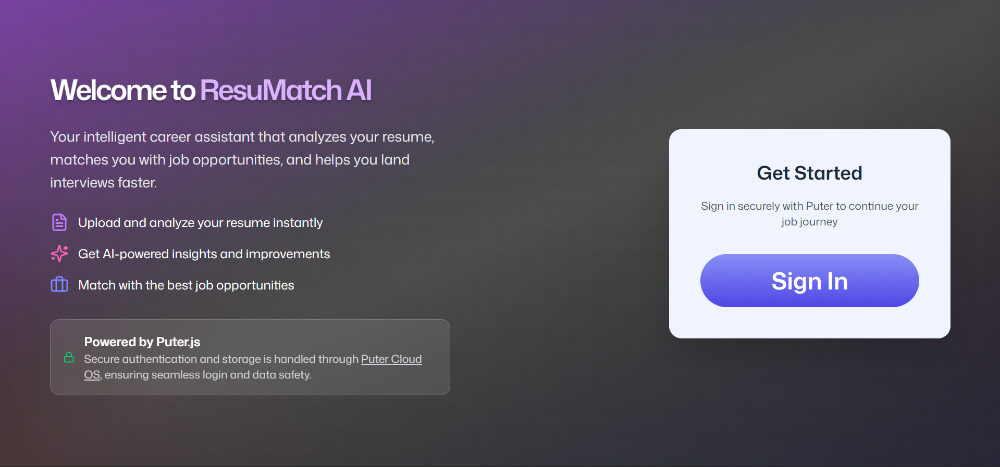

# ResuMatch AI  

ResuMatch AI is an intelligent resume analysis tool designed to help job seekers improve their resumes for Applicant Tracking Systems (ATS) and recruiters.  
It provides actionable feedback, scoring, and improvement tips powered by **AI** and backed by the **[Puter](https://docs.puter.com/)** backend service for authentication and file handling.  
Note: This project is inspired by [JavaScript Mastery](https://jsmastery.com/)`s AI-powered Resume Analyzer course

---

## ✨ Features  

- 🔐 **Authentication via Puter** – Secure sign-in with external browser flow.  
- 📂 **Resume Upload & Parsing** – Upload resumes for instant analysis.  
- 🧠 **AI-Powered Insights** – Get detailed tips on strengths and areas for improvement.  
- 📊 **Scoring System** – Visual feedback with badges (Strong, Good Start, Needs Work).  
- 💡 **Improvement Suggestions** – Actionable items tailored to ATS optimization.  
- 🖼️ **Modern UI** – Clean React + TailwindCSS interface with animations.  

---

## 🛠️ Tech Stack  

- **Frontend:** [React Router v7](https://reactrouter.com/), TypeScript, TailwindCSS, Lucide Icons  
- **Backend Service:** [Puter API](https://docs.puter.com/) (file storage, auth, and cloud functions)  
- **AI Integration:** Puter AI services for resume parsing and scoring  

---

## 📸 Screenshots  



---

## Getting Started

### 1. Clone the repo  
```bash
git clone https://github.com/cmarkgonzales/resumatch-ai.git
cd resumatch-ai
```

### 2. Install dependencies
```bash
# Make sure to use node v20+
npm install
```

### 3. Run locally
```bash
npm run dev
Your application will be available at `http://localhost:5173`.
```

### Docker Deployment

To build and run using Docker:

```bash
docker build -t resumatch-ai .

# Run the container
docker run -p 3000:3000 resumatch-ai
```
---

## 🔐 Authentication Flow
ResuMatch AI uses Puter’s external browser sign-in:

- Sign in opens in your default browser.
- Both registration and login are managed externally.
- After successful sign-in, the app receives the token for secured API requests.

### Future Improvements
- 📈 Integration with LinkedIn/Indeed profile parsing
- 🌍 Multi-language resume support
- 🎯 Job-specific resume tailoring suggestions
- ☁️ Cloud resume storage and history tracking
